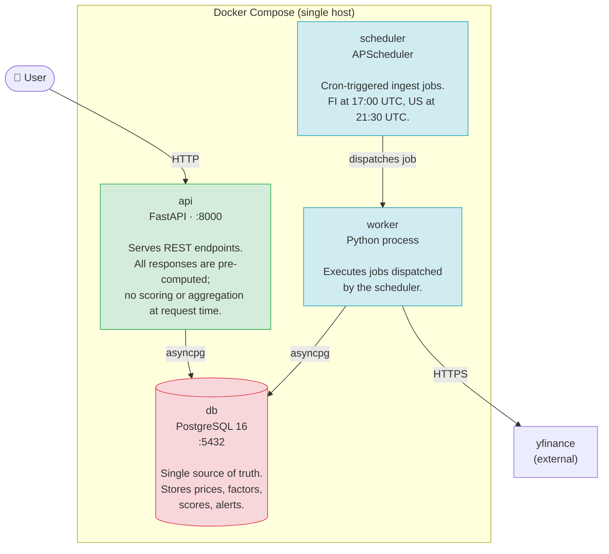

# Containers (C4 Level 2)

The system is a **modular monolith** — a single Docker image run as three processes, each with a distinct responsibility. This keeps operations simple while enforcing the same module boundaries a microservices design would require.

## Container responsibilities

| Container | Image | Start command | Scales? |
|---|---|---|---|
| `api` | `./backend` | `uvicorn app.main:app` | Yes (Phase 4) |
| `scheduler` | `./backend` | `python -m app.jobs.scheduler` | No — single instance |
| `worker` | `./backend` | `python -m app.jobs.worker` | Yes (Redis/RQ in Phase 3) |
| `db` | `postgres:16-alpine` | — | No (single node, Phase 4 if needed) |

All three application containers are built from the same `./backend` Dockerfile and share the same codebase — they differ only in their startup command and environment variables.
