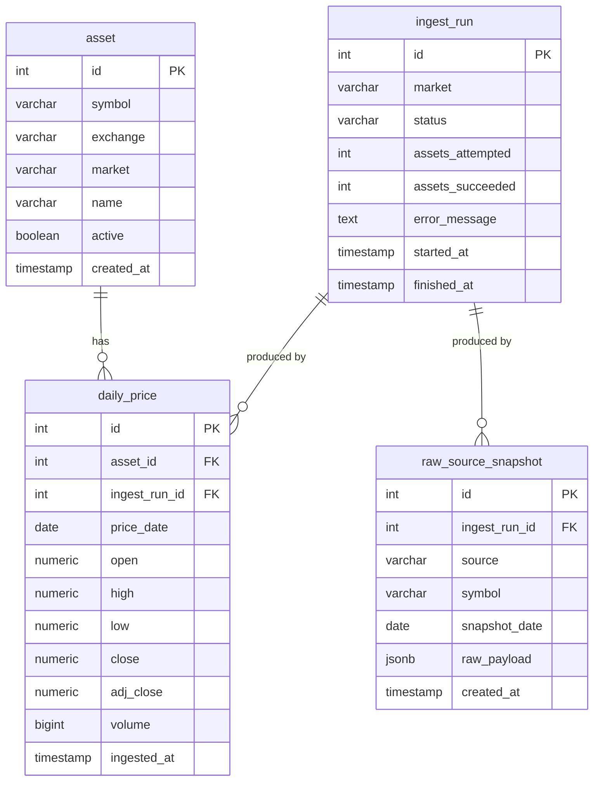

# Data Model

## Entity Relationship Diagram

## Table descriptions

### `asset`
Master list of tracked securities. The `symbol` + `exchange` pair is unique. `active = false` soft-deletes an asset without losing its price history.

### `ingest_run`
Audit log of every scheduled ingest execution. Records start/finish timestamps, how many assets were attempted/succeeded, and any error message. Used by the health check endpoint to detect staleness.

### `daily_price`
One row per asset per trading day. `ON CONFLICT (asset_id, price_date) DO UPDATE` makes ingests idempotent — re-running a job corrects rather than duplicates data.

**Index:** `(asset_id, price_date DESC)` — covers the common query pattern of fetching recent price history for a single asset.

### `raw_source_snapshot`
Immutable copy of the raw API response (JSONB) for every fetch. Enables full audit trail and replay without re-fetching from the external source.

## Planned tables (Phase 2+)

| Table | Phase | Purpose |
|---|---|---|
| `fundamental_snapshot` | 2 | Raw income statement / balance sheet data |
| `factor_snapshot` | 2 | Computed signal values per asset per day |
| `score_snapshot` | 2 | Composite scores (long + short horizon) |
| `ranking_snapshot` | 2 | Materialised daily rankings |
| `alert_rule` | 3 | User-defined threshold conditions |
| `alert_event` | 3 | Fired alert instances |
