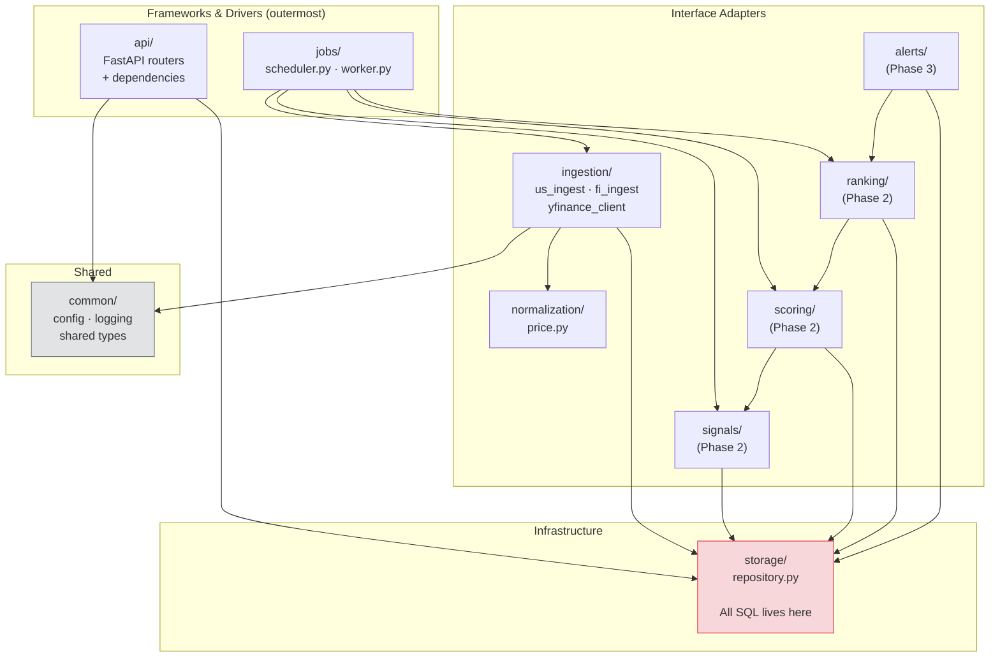

# Module Boundaries (C4 Level 3)

All application code lives in `backend/app/`. Modules follow **Clean Architecture** — dependencies point inward only. No inner module may import from an outer one.

## Import rule

> **No module may import from a sibling module at the same layer, or from an outer layer.**

Concrete violations that are **blocked**:

| Import | Why it's blocked |
|---|---|
| `api` → `ingestion` | API layer must not trigger data fetching |
| `scoring` → `api` | Inner layer must not know about HTTP |
| `ingestion` → `signals` | Ingest pipeline is write-path only |
| Any module → `jobs` | Jobs are entry points, not libraries |

This rule is enforced automatically in CI by `tests/architecture/test_dependency_rules.py` (Task 1.8).

## Module inventory

| Module | Layer | Phase | Responsibility |
|---|---|---|---|
| `api/` | Frameworks | 1 | HTTP routing, request validation, response serialisation |
| `jobs/` | Frameworks | 1 | Cron scheduling, worker entry point |
| `ingestion/` | Adapters | 1 | Fetch raw data from external sources, orchestrate write path |
| `normalization/` | Adapters | 1 | Translate raw API payloads into typed domain objects |
| `storage/` | Infrastructure | 1 | All SQL — reads and writes, no business logic |
| `common/` | Shared | 1 | Settings (Pydantic), logging config, type aliases |
| `signals/` | Adapters | 2 | Compute technical + fundamental factor values |
| `scoring/` | Adapters | 2 | Assemble composite scores from signals |
| `ranking/` | Adapters | 2 | Materialise daily rankings |
| `alerts/` | Adapters | 3 | Evaluate alert rules, generate alert events |
