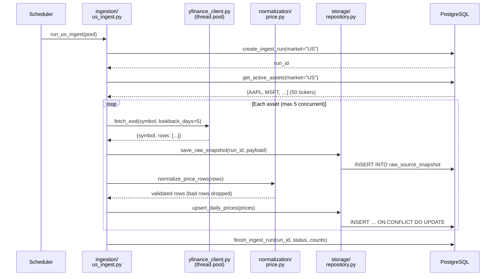
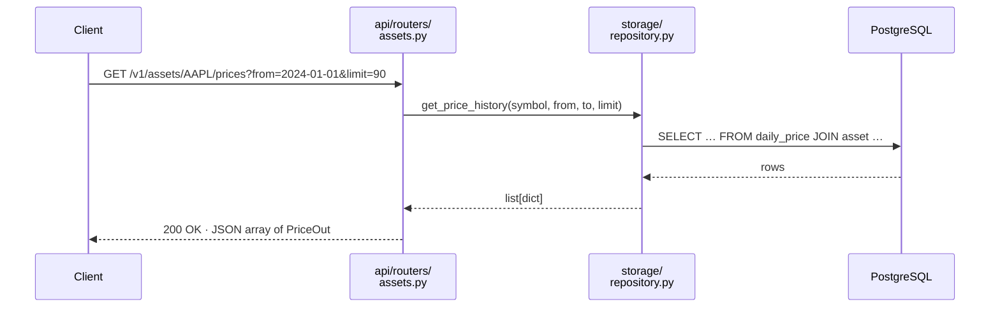
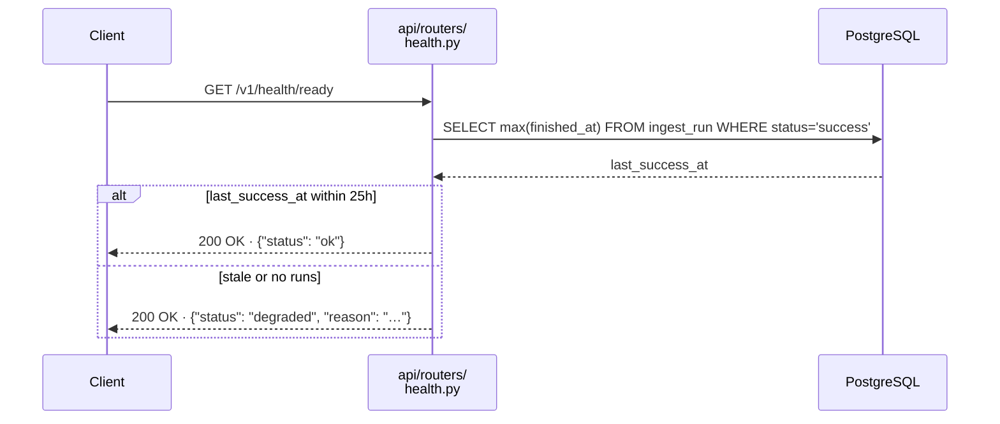

# Key Flows

## EOD Price Ingest

Triggered by the scheduler at market close (17:00 UTC for Helsinki, 21:30 UTC for US).

## API Price History Query

A read-only path — no computation happens at request time.

## Health Check (Task 1.7)

Checks whether the most recent ingest run finished within the last 25 hours.

