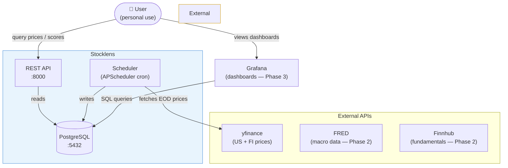

# System Context (C4 Level 1)

Stocklens sits between the user and a set of free financial data APIs. It ingests, normalises, and stores price data, then exposes it via a REST API and Grafana dashboards.

## Scope boundary

Everything inside the **Stocklens** box is owned, deployed, and operated by this project. External APIs are third-party services consumed over HTTPS — Stocklens has no write access to them.

| Actor | Role |
|---|---|
| User | Queries the REST API, views Grafana dashboards |
| yfinance | Primary source of EOD price data (US + Helsinki exchange) |
| FRED | Macro-economic indicators (Phase 2) |
| Finnhub | Fundamental data supplement (Phase 2) |
| Grafana | Read-only dashboards over PostgreSQL (Phase 3) |
